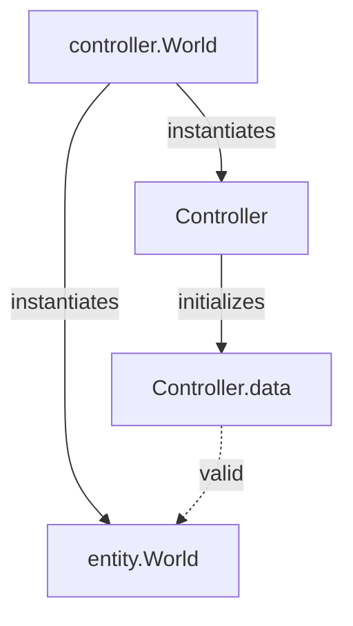
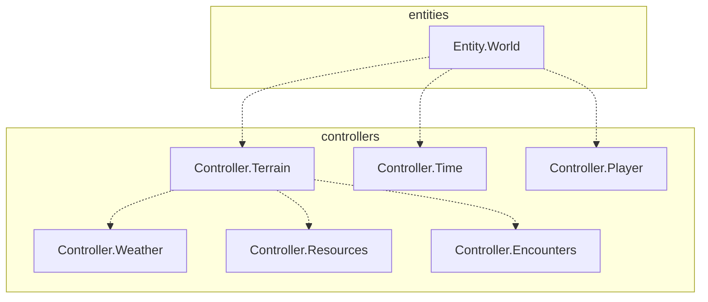

# Rpg-Simulator

## Documentation

## Dev

### TODO

#### Working

- [x] ~~check that no errors appear after restructuring utils~~ *not a great idea, requires script instantiation management -- not worth*
- [x] ensure all existing controller functions have return types for easier error resolving
- [ ] check that all resolvable TODO comments are resolved

#### Done

### Reference

World Controller Init Flow

World Controller Dependencies

