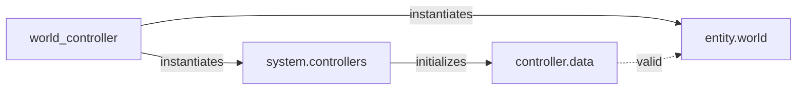
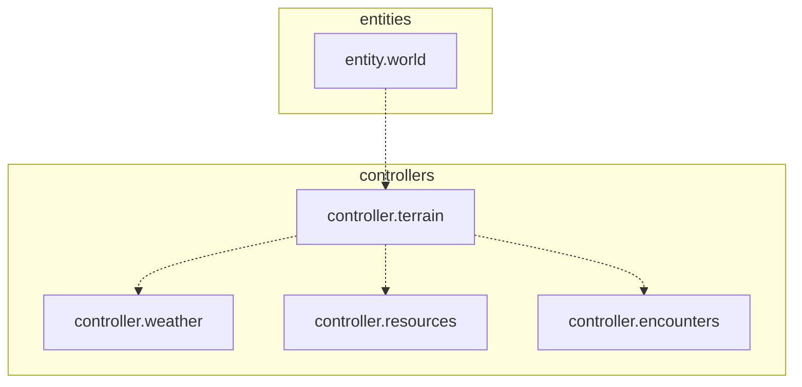

# Rpg-Simulator

## Documentation

## Dev

### Structure

Top-level diagram of Initialization Flow

```mermaid
flowchart LR
    world_controller --instantiates--> entity.world
    
    world_controller --instantiates--> system.controllers
    system.controllers --initializes--> controller.data
    controller.data -.valid.-> entity.world
    
```

Controller Dependencies

```mermaid
flowchart
    subgraph entities
        entity.world
    end

    entity.world -.-> controller.terrain

    subgraph controllers
        controller.terrain
        controller.weather
        controller.resources
        controller.encounters

        controller.terrain -.-> controller.weather
        controller.terrain -.-> controller.resources
        controller.terrain -.-> controller.encounters
    end

    
```