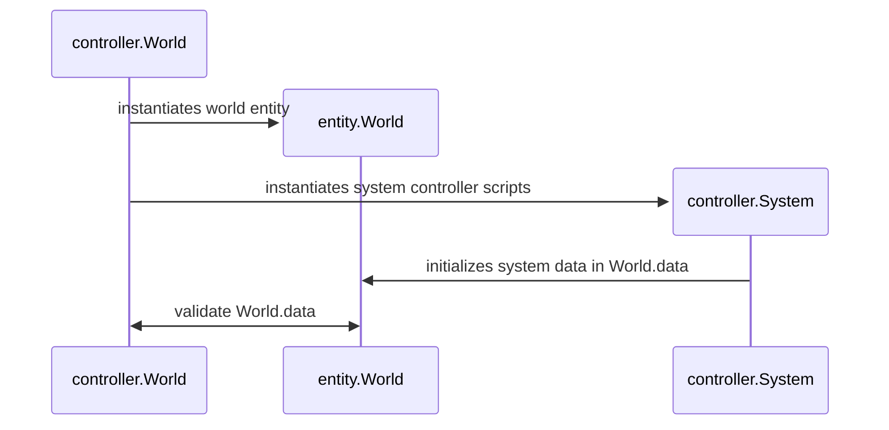

# Rpg-Simulator

## Documentation

## Dev

### TODO

#### Working

- [ ] 

#### Done

- [x] scrap current encounters system
    - [x] remove from time controller
    - [x] revert player controller logic
    - [x] revert enemy controller
- [x] revert time controller
- [x] time_controller only controls time system, not dependencies
        - _routing dependency systems through time_controller results in too many states and sub-states to manage effectively_
        - _instead of trying to rewrite the internal \_process system, utilize it_
- [x] make dependency controllers call \_process directly
- [x] validate dependency controllers at controller-level during processing

### Reference

