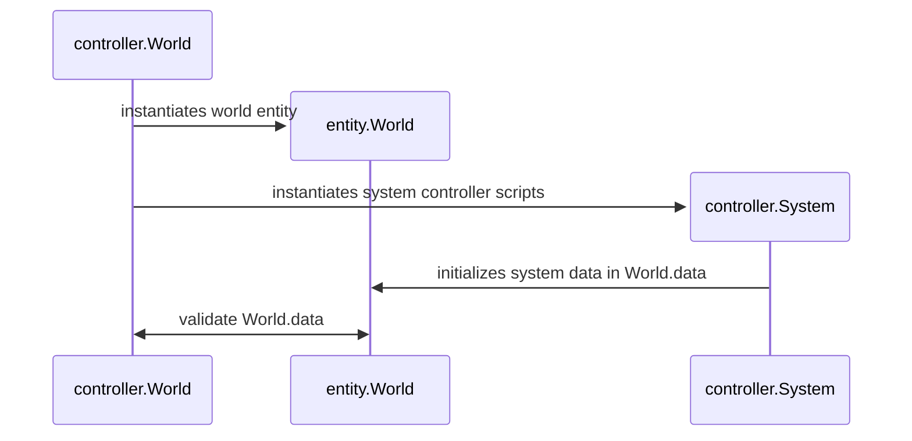

# Rpg-Simulator

## Documentation

## Dev

### TODO

#### Working

- [ ] implement basic attacks

#### Done

- [x] scrap current encounters system
    - [x] remove from time controller
    - [x] revert player controller logic
    - [x] revert enemy controller
- [x] revert time controller
- [x] time_controller only controls time system, not dependencies
        - _routing dependency systems through time_controller results in too many states and sub-states to manage effectively_
        - _instead of trying to rewrite the internal \_process system, utilize it_
- [x] make dependency controllers call \_process directly
- [x] validate dependency controllers at controller-level during processing
- [x] rework encounter system
    - [x] remove current _encounter_ data in tiles
    - [x] every resource has _r_ chance to spawn an enemy encounter before the resource is collected
    - [x] on _encounter_, encounter controller makes calls to involved entity controllers until an entity is defeated
- [x] ensure entity controllers are checking for defeat conditions at all times
- [x] implement logging to log file per game
- [x] implement fundamental systems: resource collection, encounters, player stat progression
- [x] refactor codebase
- [x] add base entity controller and reorganize player/enemy controller functions according to class hierarchy
- [x] re-implement actions controller on player/enemy entities
    - _I have considered how to implement time in this game, and I believe the best model is this:_
        - _the time controller asserts when time cycles occur and how long they are_
        - _entity actions have a certain duration consisting of time cycle integers_
        - _entity actions are carried out until completion, but are only evaluated during time cycles_
            - _since entity actions are whole integers, action completion will be determined by the number of time cycles, rather than the length of the events occuring during a time cycle_
            - _this also means we can clear up any errors before the start of the next cycle, but after (and not during)events/actions have occurred_

### Reference

World Initialization

