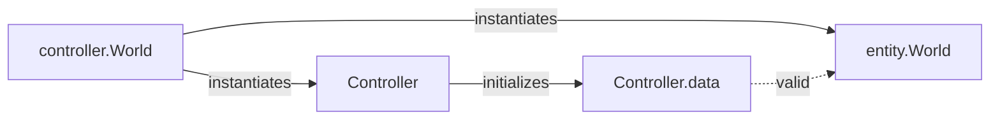
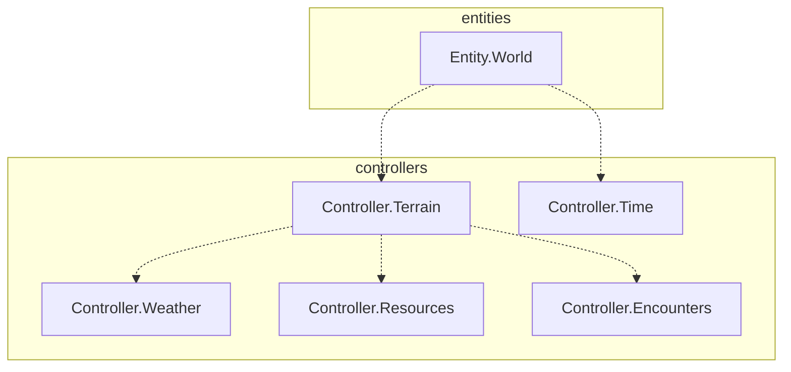
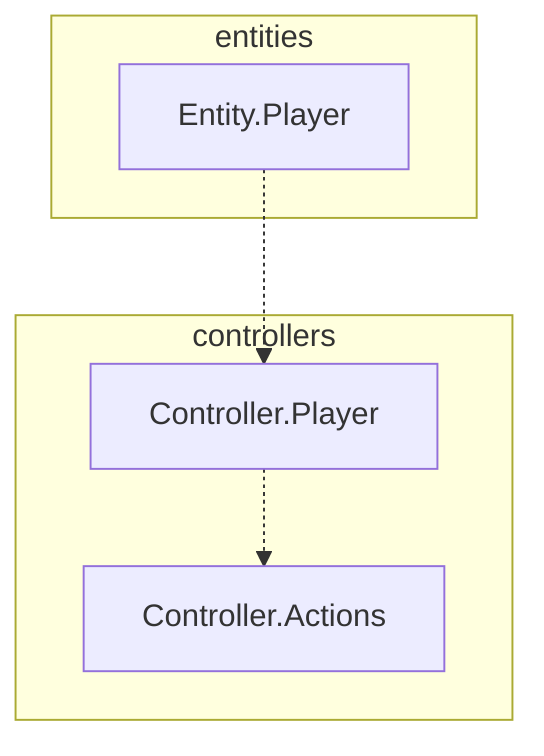

# Rpg-Simulator

## Documentation

## Dev

### Structure

Top-level diagram of Initialization Flow

```mermaid
flowchart LR
    controller.World --instantiates--> entity.World
    
    controller.World --instantiates--> Controller
    Controller --initializes--> Controller.data
    Controller.data -.valid.-> entity.World
    
```

World Controller Dependencies

```mermaid
flowchart
    subgraph entities
        Entity.World

    end

    Entity.World -.-> Controller.Terrain
    Entity.World -.-> Controller.Time

    subgraph controllers
        Controller.Terrain
        Controller.Weather
        Controller.Resources
        Controller.Encounters
        Controller.Time

        Controller.Terrain -.-> Controller.Weather
        Controller.Terrain -.-> Controller.Resources
        Controller.Terrain -.-> Controller.Encounters

    end

```

Player Controller Dependencies

```mermaid
flowchart
    subgraph entities
        Entity.Player

    end

    Entity.Player -.-> Controller.Player

    subgraph controllers
        Controller.Player
        Controller.Actions

        Controller.Player -.-> Controller.Actions
    end

```